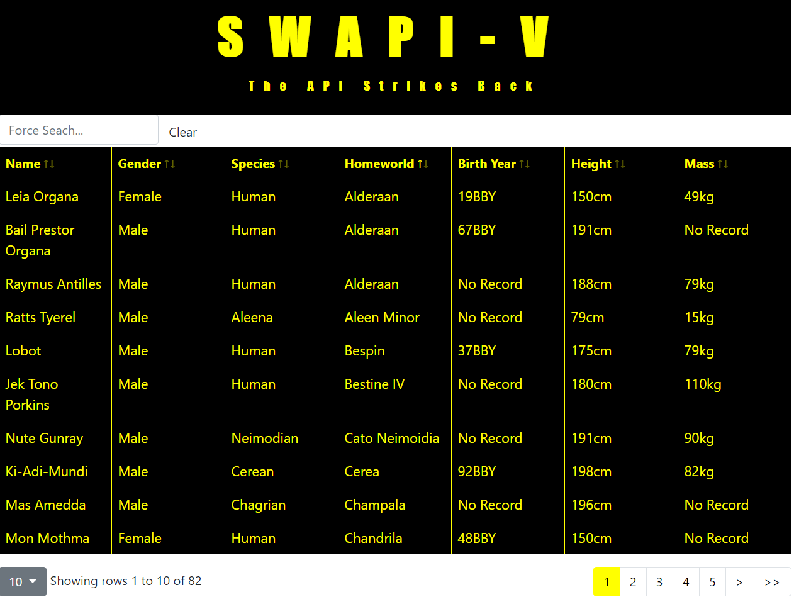

# SWAPI-V
## Star Wars API Visualizations and processing

This project is hosted on Heroku [View SWAPI-V](https://swapi-v.herokuapp.com/).

## Summary

This app was an ejoyable build. I used this platform to inform my React knowledge. In the process I added several npm packages including Bootstrap 5, Chart.js, and poppper. This app pushed me into learning the react context api. I chose context over redux to keep the code as lean as possible.

## Features

<ul>
  <li> Displays data for over 80 Starwars Characters
  <li> Searchable Table
  <li> Sort by any column
  <li> Pagination and item count
  <li> classic Episode V Theme & Style
</ul>

#### Wish List

<ul>
  <li> Summary Table
  <li> Films Column
  <li> Character Photos
</ul>

## Technologies

<ul>
  <li> React, Bootstrap, Git
  <li> HTML5, CSS, JavaScript
  <li> HTML Canvas
</ul>

### Helpful Resources

Heroku Mixed resources error [Stack Overflow Meta Solution](https://stackoverflow.com/questions/65044736/mixed-content-error-on-react-project-using-swapi-star-wars-api)
Axios Promise All [Youtube Promise Methods](https://www.youtube.com/watch?v=B-Qd60jF1NY)

### Author

Duane McDonald | Software Developer  
<a href="https://www.linkedin.com/in/duane-mcdonald-48a90136">linkedIn</a>  
<a href="https://www.DuaneMcDonald.com">Personal Website</a>  

